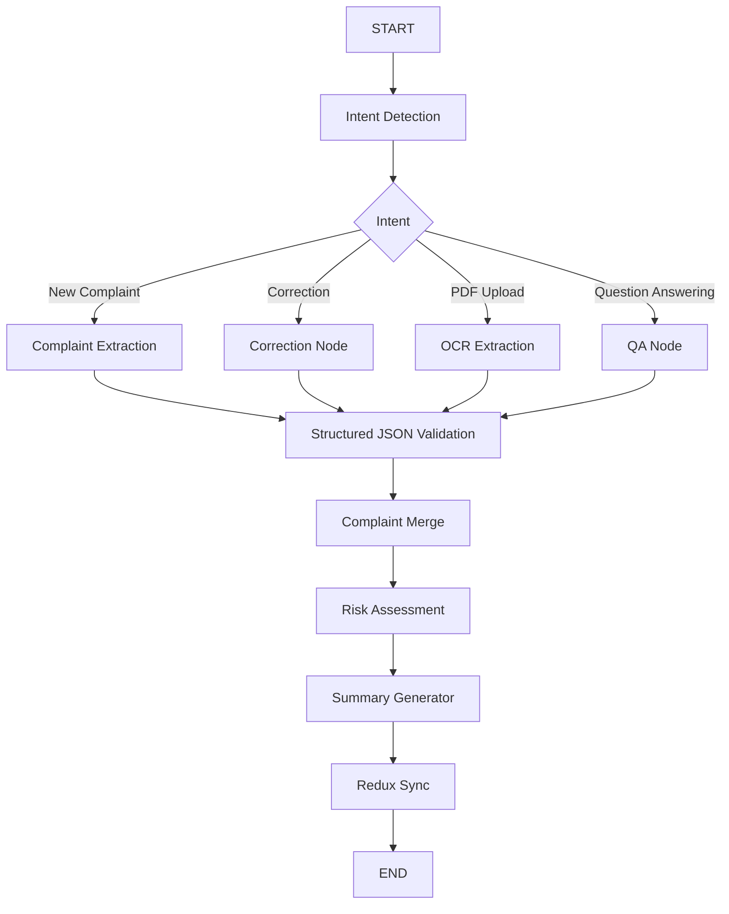

# LangGraph Workflow

```mermaid
flowchart TD
    A[START] --> B[Intent Detection]
    B --> C{Intent}
    C -->|New Complaint| D[Complaint Extraction]
    C -->|Correction| E[Correction Node]
    C -->|PDF Upload| F[OCR Extraction]
    C -->|Question Answering| G[QA Node]
    D --> H[Structured JSON Validation]
    E --> H
    F --> H
    G --> H
    H --> I[Complaint Merge]
    I --> J[Risk Assessment]
    J --> K[Summary Generator]
    K --> L[Redux Sync]
    L --> M[END]
```

The correction branch returns a field patch only. The merge node applies that patch to the existing complaint state so unrelated values are never regenerated.

